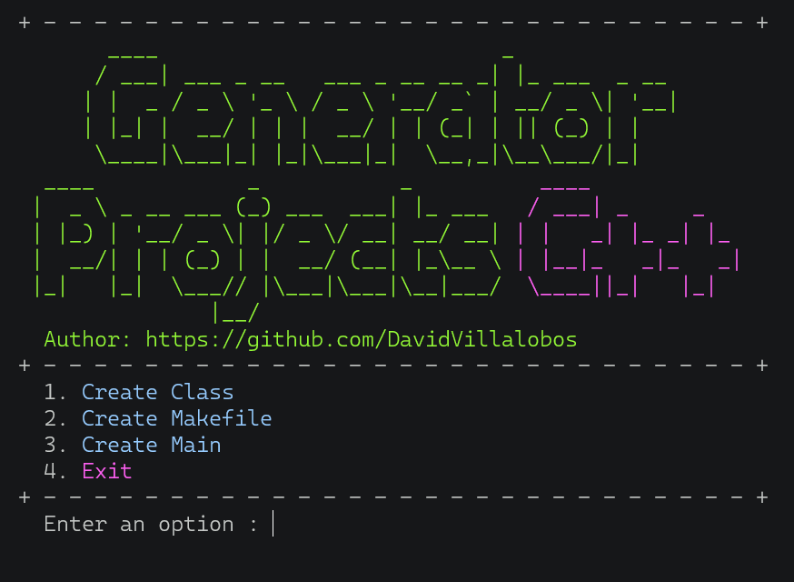

# Generator of Projects C++ 

The purpose of this project is to optimize the process of implementing projects in C ++, 
allowing to create classes quickly, implementing the body and the basic methods of the classes 
from the attributes, like getter and setter, also builder with and without parameters. 
This project was created with python.

### Pre-requirements 📋

* 	[Python](https://www.python.org/) Need minimum the third version
* 	[Mingw](https://osdn.net/projects/mingw/releases/) Need install g++.exe from basic setup  
	and mingw32-make.exe from all packages

## Installation

Only need to download three files class_generator.py, makefile_generator.py and init.bat from this repository  
You can download it with curl like:  

```bash
curl https://raw.githubusercontent.com/DavidVillalobos/Class_Generator/master/src/class_generator.py --output class_generator.py
curl https://raw.githubusercontent.com/DavidVillalobos/Class_Generator/master/src/makefile_generator.py --output class_generator.py
curl https://raw.githubusercontent.com/DavidVillalobos/Class_Generator/master/src/init.bat --output class_generator.py
```

## Configuration

1. 	Download the files and place them in the space of your choice.  
2. 	If you just downloaded python and mingw make sure that the system  
	recognizes their locations in the system path variables.  
3.	For ease of use, it is necessary to create an environment variable  
	called DESKTOP where the generated classes or makefiles are to be  
	stored. In my case the desk.  
4.	I recommend renaming mingw32-make.exe to make.exe, for ease of use.

## Usage  

Open the file init.bat  
Now you can choose what option you want in the menu

   

### 1. Create Class C++

To create the classes, there are two ways 

1. Sending the data as arguments
> Allows sending the data as an argument  
Example:    
Creating the person class with id, name and age    
in offline mode with the overloaded constructor  

    

2. Sending the data interactively

> It also allows to be created interactively:    
Example:  
Creating the student class with name, card and average   
in inline mode with the constructor not overloaded   

    

### 2. Create a Makefile
To create the makefile, there are two ways 
1. Sending the data as arguments  
2. Sending the data interactively  

## Author

 * [David Villalobos](https://github.com/DavidVillalobos)

## Contributing

Pull requests are welcome. For major changes, please open an issue first to discuss what you would like to change.

## License


